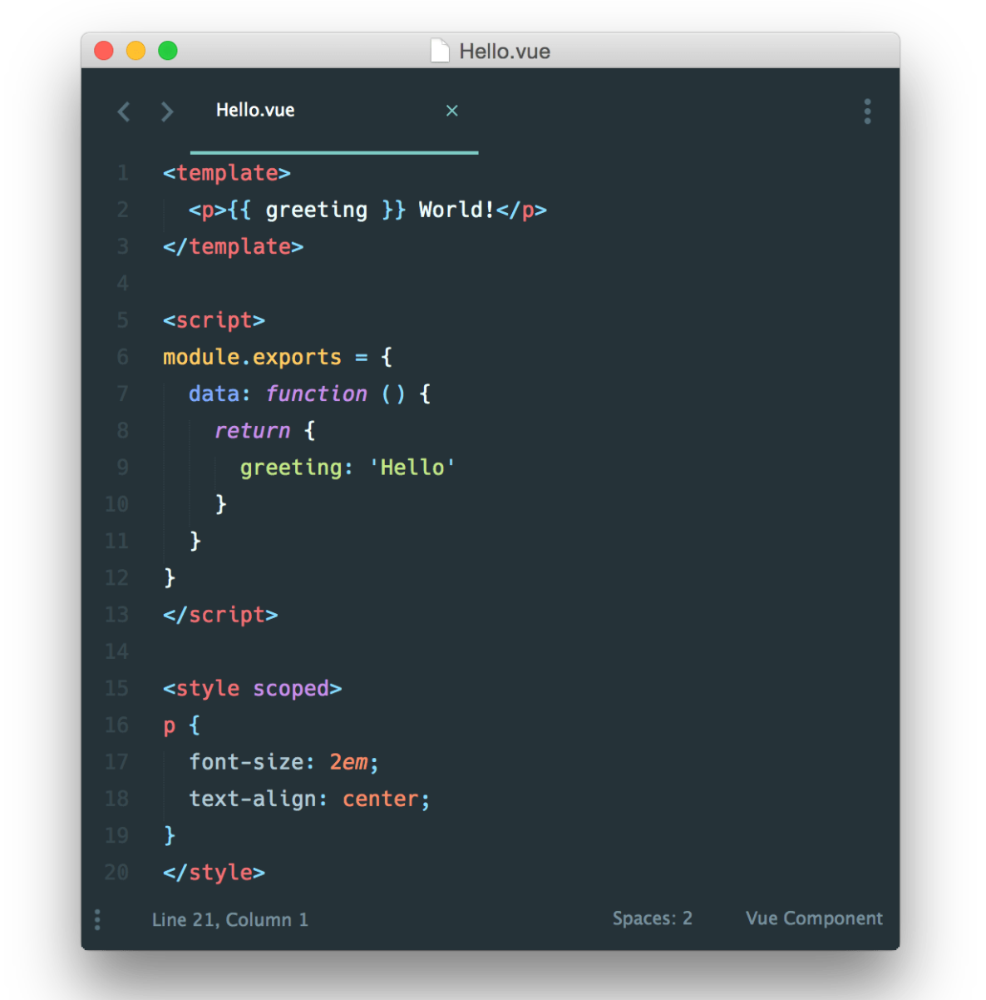
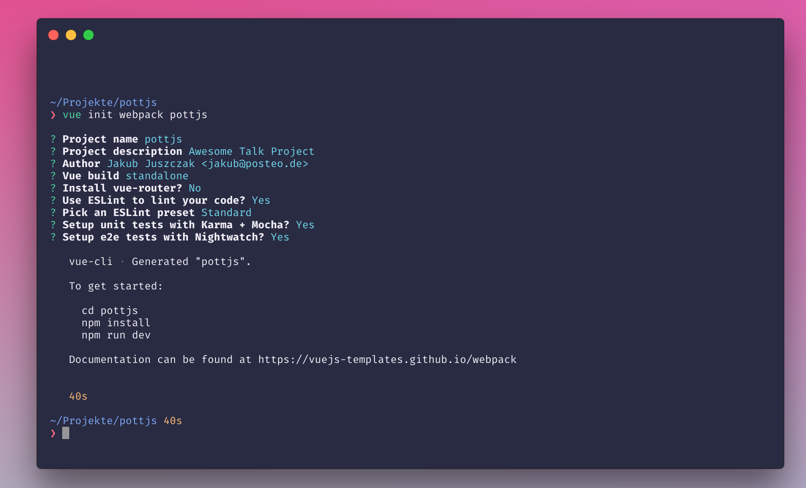
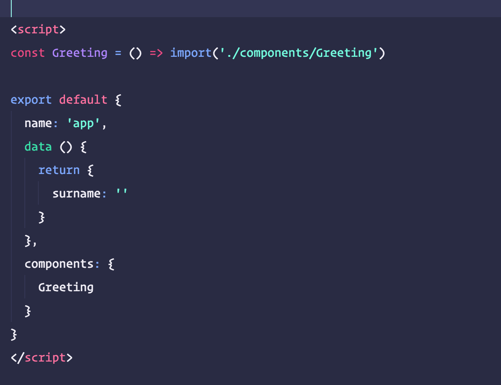
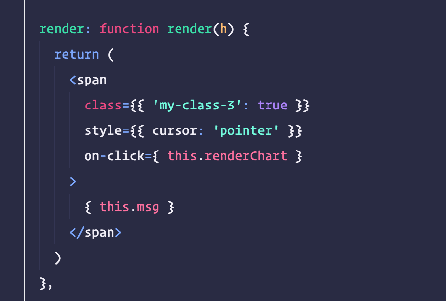
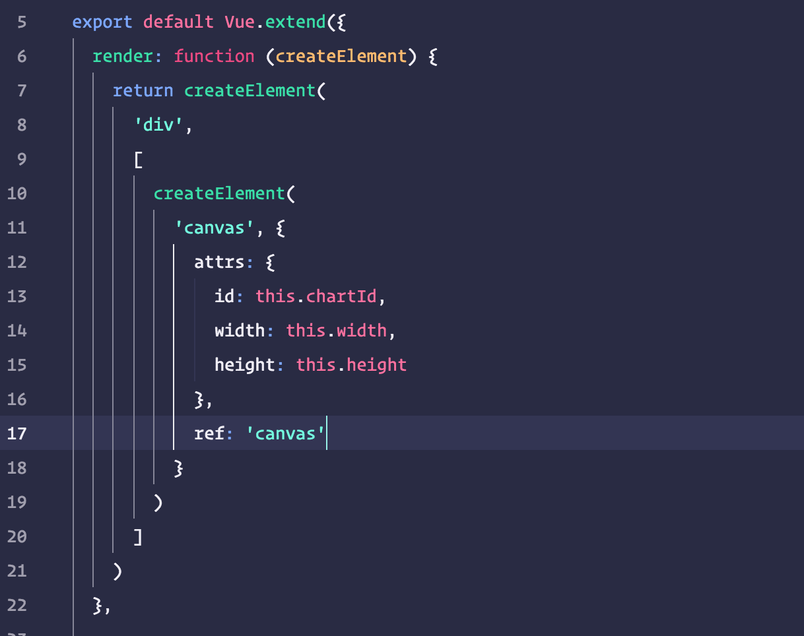

slidenumbers: true
build-lists: true

# 💉 Frontend on *Steroids*
## With Vue.js

---

# Was ist _Vue.js_ ?

---

> A progressive, incrementally-adoptable JavaScript framework for building UI on the web. 
-- Github Beschreibung

---

# Warum?


---

## Vorteile

- Sehr einfach zu erlernen
- Starten ohne viel Konfiguration
- Flexibel einsetzbar
- Modular
- "*Choice driven*"
- Klein & schnell (28.03kb min+gzip)
- Macht Spaß 🎢

---

# ⚡ Quickstart

---

Auch ohne Build Pipeline einsetzbar:

```html
<script src="https://unpkg.com/vue"></script>
```

Ansonsten

```
yarn add vue
```

Besser

```
yarn add -g vue-cli 
```


---

# _2_ Bestandteile

---

## Script

```javascript
const app = new Vue({
  el: '#app',
  data: {
    message: 'Hello Vue!'
  }
})
```

---

## Template:

```html
<div id="app">
  {{ message }}
</div>
```


---


# _Single File_ Components

---

## Single File Components

- Inspiriert von Web Components
- *.vue Endung
- Template
- Script
- Styling

---

## Hello.vue



---

# 🚀 Vorteile

---

- Kleine modulare Komponenten
- Shareable
- Saubere Kommunikation über props und events
- Testbar

---

# 💻 vue-cli

---

- Scaffold für Vue Projekte
- Optionen für 
	- `vue-router`
	- `eslint`
	- Unit Tests mit `karma`
	- E2E Tests mit `nightwatch`


---



---

# 📺 Demo

---

## Weitere Features

- Methods
- Computed properties
- Filters
- Mixins
- Directives
- Props

--- 

# 📦 Code *Splitting*

--- 



---

# Integration
## In bestehende System

---


---
- Weniger Code
- Inkrementell erweiterbar
- Kleine ersetzbare Komponenten[^1]

[^1]: https://about.gitlab.com/2016/10/20/why-we-chose-vue/

---

# [fit]Think *Big*

---

# Große Projekte
## sind komplex

---

# 👮 State Management

---

# vuex

---
## *Besteht* aus
- State
- Mutations
- Actions
- Getters
- Modules


---

# 💊


---

# JSX

---



---

# 🤔 Render functions 

---



---

# redux

## typescript

---

# Testing

## Jest

## Ava

## Karma

---

# Community

---

# 🙊 Fragen?

### @apertureless
### jakub@posteo.de
